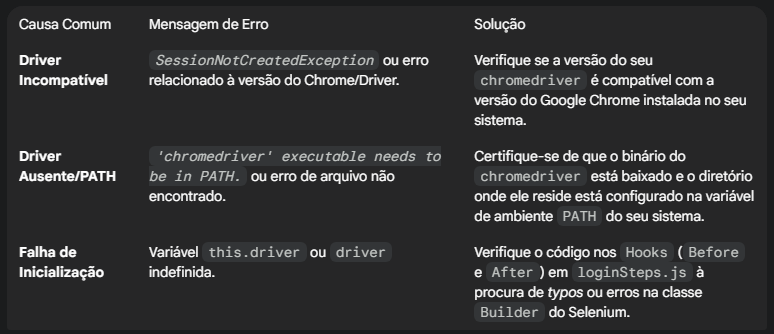

🥒 cucumber-banco-api: Testes E2E (Web)

Suíte de testes End-to-End (E2E) para a aplicação web do banco, utilizando Cucumber (Gherkin) para definição de cenários e Selenium WebDriver para automação no navegador Chrome.

🎯 Objetivo

O objetivo principal deste projeto é validar o fluxo crítico de login da aplicação:

Cenário principal: "Login com sucesso", garantindo o acesso e a navegação correta até a página inicial após a autenticação.

💻 Pré-requisitos

Para rodar o projeto, você precisa ter instalado:

1. Node.js: Versão 20 ou superior (recomendado).
2. Aplicação Web: A aplicação web do banco deve estar rodando em http://localhost:4000 (ou ajuste a URL nos arquivos de steps).

🛠️ Instalação e Configuração
Siga os passos abaixo para preparar o ambiente:

1. Navegue até o diretório do projeto:

bash
cd c:\caminho\para\seu\projeto

2. Instale as dependências do Node:

bash
npm install

3. Instale o selenium-webdriver / cucumber

bash 
npm install selenium-webdriver @cucumber/cucumber

🧩 Extensões Recomendadas do VS Code

1. Cucumber (Gherkin) Full Support

* Autor: Alexander Krechik

▶️ Execução dos Testes

bash
npm run test

Direto com o npx
Você pode executar o Cucumber diretamente (útil para testes ad-hoc ou debugging):

bash
npx cucumber-js

📂 Estrutura do Repositório
A organização do projeto segue a convenção do Cucumber:

cucumber-banco-api/
├── features/
│   ├── login.feature               # Definição do(s) cenário(s) de login em Gherkin.
│   └── step_definitions/
│       └── loginSteps.js           # Implementação do código (Selenium) para cada step, hooks (Before/After) e asserções.
├── package.json
└── package-lock.json

⚠️ Observações e Solução de Problemas

1. Seletores e Falhas na Interface (UI)

O Problema: Os testes falham quando o Selenium não consegue localizar um elemento (erro NoSuchElementException). Isso geralmente ocorre após mudanças na interface do usuário (UI) ou carregamento assíncrono.

* Ação Recomendada:

  * Priorize IDs: Sempre que possível, utilize seletores baseados em IDs únicos, pois são os mais rápidos e estáveis.

  * XPath vs. CSS: Evite o uso de XPaths absolutos ou muito longos. Prefira seletores CSS que sejam mais curtos e resilientes a pequenas mudanças no DOM.

  * Debug: Em caso de falha, inspecione a UI da aplicação web para verificar se o seletor em loginSteps.js corresponde à estrutura HTML atual.

2. Timeouts

* Tempo de Espera: Elementos carregando lentamente podem exigir ajustes nos timeouts configurados no Selenium.

3. Problemas no Driver do Selenium

* Inicialização: Os hooks Before e After são responsáveis por criar e encerrar a instância do WebDriver.

* O WebDriver é o binário que permite que o Selenium controle o Chrome. Falhas na inicialização impedem a execução de todos os testes.

